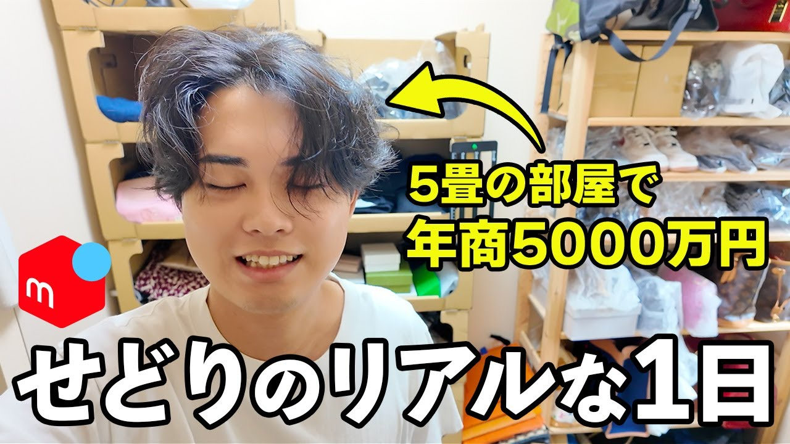

# 動画分析レポート: 【最強の副業】メルカリせどりで年商5000万稼ぐ平凡アラサー男子の店舗仕入れに1日密着！【在宅ワーク/副業/中古物販】

> **Manatoメソッド8フェーズ分析**

- **動画ID**: `EoRhrKsbG94`
- **チャンネル**: 5畳せどらーメルカリかっちゃん（登録者 4,880人）
- **再生数**: 153,646
- **いいね数**: 1,428
- **コメント数**: 114
- **動画長**: 32:21
- **公開日**: 2025-09-06T11:00:32Z

## 🎯 Phase 8: 統合インサイト（核心）

> **「5畳の部屋で年商5000万」という常識破りのギャップと「平凡アラサー男子」という親近感が、視聴者の「自分にもできるかも」という希望と「成功者のリアルを知りたい」という好奇心を爆発させ、アッパーを完全に突破した大バズ動画。**

### 3層ニーズ

| 層 | 内容 |
|---|---|
| 表層 | 手軽に始められる副業で高収入を得たい、メルカリせどりの具体的なノウハウを知りたい、在宅で稼ぎたい、成功者のリアルな日常を覗きたい。 |
| 中層 | 本当にメルカリせどりで年商5000万も稼げるのか？具体的な仕入れ判断のコツや偽物対策、税金・古物許可証などの法的な側面、そして効率的な運営方法を知りたい。 |
| 深層 | 経済的な不安から解放されたい、現状を変えたい、特別なスキルや環境がなくても成功できる自分になりたい、努力が報われる希望を感じたい、尊敬される存在になりたいという自己肯定感の欲求。 |

### 感動ポイント
- **サムネとタイトルで「5畳の部屋で年商5000万円」という強烈なギャップが提示された瞬間。** — 「限られた環境でもこんなに稼げるのか！」という驚きと、「自分にもできるかもしれない」という希望を強く感じたため。
- **冒頭で「毎日せどりやってるわけじゃなくて、自分のスタイルを崩さずゆるゆるやってる」と語られた瞬間。** — せどりは大変というイメージを覆し、「無理なく続けられる」という安心感と共感を得られたため。ハードルが下がったと感じたため。
- **店舗での具体的なリサーチ方法や利益商品の見つけ方、仕入れ判断のコツが詳細に解説された瞬間。** — 「知識量が凄すぎる...」というコメントにもあるように、実践的で具体的なノウハウが惜しみなく開示され、視聴者の「知りたい」という欲求が満たされたため。
- **ペットのために稼ぐというモチベーションが語られた瞬間。** — 単なる金儲けではなく、大切なもののために頑張るという人間味あふれる動機に共感し、親近感と信頼感が深まったため。

### 希望の未来
平凡な自分でも、この動画で得た知識とモチベーションを元にメルカリせどりを始めれば、無理なく年商5000万円のような大きな収入を得て、経済的な自由と豊かな生活を手に入れられるかもしれない。特別な環境やスキルがなくても、自分も成功できるという希望と、現状を変えられる可能性を感じられる未来。

### 伸びた要因 Top3
1. 「5畳の部屋で年商5000万円」という、常識を覆すような強烈なギャップと具体的な数字が、視聴者の好奇心と「自分にもできるかも」という希望を最大限に刺激した。（サムネ、タイトル）
2. 「平凡アラサー男子」という親近感のあるキャラクター設定と、リアルな「1日密着」ドキュメンタリー形式が、信頼性と共感を醸成し、視聴者が感情移入しやすかった。（タイトル、台本構成、コメント）
3. 副業・物販・在宅ワークといった、現代の多くの人が抱える「収入アップ」や「経済的自立」という普遍的かつ強いニーズに、具体的な「メルカリせどり」という手段で応えた。（サムネ、タイトル、コメント）

### アッパー評価
- **欲求の大きさ**: 非常に大きい（経済的自由、収入アップ、現状打破）
- **手段の魅力度**: 非常に高い（メルカリせどり、店舗仕入れ、在宅ワークの手軽さ）
- **切り取り率**: 推定 90%以上
- **突破判定**: Yes — サムネとタイトルが「5畳の部屋で年商5000万円」という強烈なギャップと具体的な数字で、視聴者の「収入アップしたい」という強い欲求と「成功者のリアルを知りたい」という好奇心を最大限に刺激した。さらに「平凡アラサー男子」という親近感が、その驚異的な数字に現実味と希望を与え、アッパー層のクリックを爆発的に誘発したため、view/sub比31.48という大バズを達成した。

### 次の企画への示唆
- 視聴者の「平凡な自分でも稼ぎたい」という深層ニーズに応える、再現性の高い具体的なノウハウ動画（例：電脳せどり密着、特定ジャンルの仕入れ解説）を継続する。
- 「税金」「古物許可証」「偽物対策」など、視聴者の心理的ハードルとなっている部分を深掘りした解説動画や、専門家との対談企画を検討する。
- 「ゆるゆる」というスタイルが共感を呼んでいるため、無理なく続けられる工夫やマインドセットに関するコンテンツ（例：モチベーション維持術、時間管理術）も有効。
- 「年商5000万」の具体的な内訳（利益率、仕入れ額、経費など）を公開し、さらに透明性を高めることで、懐疑的な層の信頼も獲得し、より深いエンゲージメントを促す。
- 視聴者からの質問が多いテーマ（例：送料を安くする方法、リサーチツール）に特化したショート動画や解説動画を制作し、ニーズにピンポイントで応える。

### まなとさんの判断
> この動画は、視聴者の深層ニーズと好奇心を強烈なギャップで刺激し、圧倒的なアッパー突破を達成した、まさに「最強の副業」動画であると断言できる。

## 🖼 Phase 3: サムネイル分析

**直感の匂い**: 「え、マジで？5畳の部屋でそんなに稼げるの？」という驚きと、ごちゃっとした部屋が逆にリアル感を醸し出し、「自分にもできるかも」という希望を感じさせる匂いがする。

### 欲求×手段
- **欲求**: 経済的な自由、収入アップ、手軽に始められる副業で成功したい、現状を変えたいという本質的な欲求。
- **手段**: メルカリせどり、店舗仕入れ、在宅ワーク、中古物販という具体的な方法。
- **アッパー仮説**: 副業や物販に興味がある層、特に手軽に高収入を得たいと考える層に強く刺さる。年商5000万円という圧倒的な数字と「5畳」という身近な環境のギャップが、夢と現実の橋渡しとなり、数百万〜数千万再生を狙えるポテンシャルがある。

### Z構図分解
| 位置 | 要素 |
|---|---|
| 左上 | 段ボール製の棚と商品らしきもの |
| 右上 | 木製の棚と商品らしきもの |
| 中央 | 人物（笑顔）、黄色い矢印、テキスト「5畳の部屋で年商5000万円」 |
| 左下 | メルカリのロゴ（赤）、テキスト「せどりのリアルな1日」の冒頭 |
| 右下 | テキスト「せどりのリアルな1日」の続き |

**フック**: 中央の「5畳の部屋で年商5000万円」という強烈なギャップと具体的な数字、そして人物の笑顔で目が止まる。特に「5000万円」という数字はインパクトが強い。

**匂い**: 「限られた環境でも大金を稼げる」「リアルな成功者の日常を覗ける」「自分にもできるかもしれない」という希望と好奇心を刺激する感覚を視聴者は受ける。

**ニーズ**: 手軽に始められる副業で高収入を得たい、成功者の具体的な日常やノウハウを知りたい、限られた環境でも成功できる方法を見つけたいという根本的な欲求。

### 4軸評価
| 軸 | 評価 | 理由 |
|---|---|---|
| インパクト | ★★★★★ | 「5畳の部屋で年商5000万円」という数字とギャップが非常に強く、人物の笑顔と矢印も視線を惹きつける。 |
| 具体性 | ★★★★☆ | 「5畳の部屋」「年商5000万円」「せどりのリアルな1日」と、場所、金額、内容が具体的に示されている。 |
| ベネフィット | ★★★★★ | 高収入（5000万円）という明確なベネフィットと、その実現方法（せどり）が提示されており、視聴者の欲求に直接訴えかける。 |
| 好奇心 | ★★★★★ | 「5畳の部屋でどうやって5000万円も稼ぐのか？」という疑問が強く湧き、動画の内容を深く知りたくなる。 |

- **権威性**: 「年商5000万円」という具体的な数字が、実績と信頼性を裏付ける権威性として強く効いている。
- **即効性**: 「リアルな1日」という表現が、すぐに実践できるような具体的な情報やノウハウへの期待感を高め、即効性を感じさせる。
- **ギャップ**: 「5畳の部屋」という狭く一般的な環境と、「年商5000万円」という桁外れの収入の対比が、強烈なギャップとして機能し、視聴者の興味を強く引きつけている。
- **デザイン親和性**: 黄色と白の文字は背景のごちゃつきの中でも視認性が高く、メルカリのロゴも赤で目立つ。背景のリアルな部屋の様子が「リアルな1日」という文言と合致しており、全体として親和性が高い。

**強み**:
- ✅ 「5畳の部屋で年商5000万円」という強烈なギャップと具体的な数字で、視聴者の好奇心と希望を同時に刺激している。
- ✅ 人物の笑顔と「リアルな1日」という文言で、信頼性と親近感を醸成している。
- ✅ 副業や物販に興味がある層の核心的な欲求を捉えている。
- ✅ 視認性の高い文字色と配置で、伝えたい情報が瞬時に伝わる。

**弱み**:
- ⚠ 背景がややごちゃついており、情報量が多いと感じる人もいるかもしれない。
- ⚠ 「せどり」という言葉を知らない層には、内容が伝わりにくい可能性がある。

> **判断**: このサムネはクリックされる。なぜなら、「5畳の部屋で年商5000万円」という、誰もが驚くような強烈なギャップと具体的な成功体験が、視聴者の「自分も稼ぎたい」「成功者のリアルを知りたい」という根本的な欲求と好奇心を最大限に刺激しているからだ。さらに、顔出しと「リアルな1日」という言葉が、その驚くべき内容に信頼性と具体性を与え、動画を見ずにはいられない心理状態を作り出している。

## 📝 Phase 4: タイトル分析

**約束**: メルカリせどりという副業で、平凡な人でも年商5000万という高額を稼ぐ具体的な方法や、その実態を1日の密着を通して見せることを約束しています。視聴者には「最強の副業」の秘密や、高収入を得るヒントが得られることを示唆しています。

- **権威性**: あり — 「年商5000万稼ぐ」という具体的な実績と数字。チャンネル名「5畳せどらー」も、限られた環境での成功を示唆し、権威性を補強しています。 ★5
- **即効性**: なし — 「30秒で」「初月から」といった直接的な即効性を示す表現はありません。「1日密着」はリアルな情報提供であり、即効性とは異なります。 ★1
- **ターゲット訴求**:  — 副業を探している人、特にメルカリせどりや中古物販、在宅ワークに興味がある人。また、「平凡」という言葉から、特別なスキルがない自分でも稼げるのかと考えるアラサー世代の男性（またはそれに近い層）に強く響きます。概要欄の悩み解決もこの層を意識しています。 ★5
- **常識否定**: あり — 「平凡アラサー男子」が「年商5000万」という高額を稼いでいるというギャップが、一般的な「せどり＝薄利多売」や「高収入は特別な人だけ」という常識を覆す可能性を示唆しています。 

- **数字**: ['5000万', '1日'] / 現実感: 「年商5000万」は非常に大きな数字ですが、「平凡アラサー男子」という枕詞があることで、現実離れしすぎず、むしろ「自分にもできるかも」という希望を持たせる絶妙なバランスです。せどりというジャンルで不可能ではないため、過大とは感じません。 / インパクト: ★5

**強み**:
- ✅ 「年商5000万」という具体的な数字による圧倒的な権威性とインパクト。
- ✅ 「平凡アラサー男子」という親近感と実績のギャップが、視聴者の好奇心と希望を強く刺激する。
- ✅ 「最強の副業」「メルカリせどり」「在宅ワーク」「副業」「中古物販」など、検索キーワードが豊富で、幅広い層にリーチできる。
- ✅ 「1日密着」という表現で、動画内容の具体性とリアリティを伝え、視聴期待を高めている。
- ✅ ターゲット層が非常に明確で、刺さる人には深く刺さる構成。

**弱み**:
- ⚠ 直接的な即効性の訴求がないため、すぐに結果を出したいと考える層には響きにくい可能性がある。
- ⚠ タイトルがやや長く、モバイル環境での表示で途切れる可能性がある。

> **判断**: このタイトルは、非常に強力な引きを持っています。具体的な数字、ギャップ、ターゲット訴求、キーワードの網羅性など、多くの観点で優れており、検索でも関連動画でも高いクリック率を期待できるでしょう。視聴者の好奇心と希望を最大限に刺激し、動画への誘導に成功すると断言できます。

## 📊 Phase 5: 数値リアリティチェック

| 指標 | 値 | 判定 |
|---|---|---|
| view/sub比率 | 31.48x | **大バズ**（完全にチャンネル外で拡散） |
| いいね率 | 0.93% | 平均的 |
| コメント率 | 0.074% | 平均的 |
| 動画長 | 長尺（30分超） | — |

> **アッパー評価**: アッパー内で順当に刺さっている。企画としては合格ライン

## 🎬 Phase 6: 台本構成分析

### 構成分解
| パート | 時間 | 内容 | 役割 |
|---|---|---|---|
| 冒頭フック | 00:00〜00:07 | 挨拶と今日の動画内容の提示（店舗仕入れ密着） | 視聴者の興味を引き、動画のテーマを伝える。 |
| 自己紹介 | 00:07〜00:14 | 自身の活動スタイル（5畳の部屋でせどり） | 親近感と共感を促す。 |
| 本日の予定と準備 | 00:14〜00:26 | 巡る店舗数と身支度の様子。 | リアルな日常感を出す。 |
| ペット紹介 | 00:26〜00:47 | ペットの紹介と、ペットのために稼ぐというモチベーション。 | キャラクター性を出し、視聴者との距離を縮める。 |
| せどりスタイルと動画の目的 | 00:47〜01:03 | 自身のせどりスタイル（ゆるゆる）と、動画でノウハウを伝えること。 | 視聴者の期待値を設定し、無理なくできることを示唆。 |
| 簡易CTA | 01:03〜01:08 | チャンネル登録といいねのお願い。 | 冒頭での離脱防止とエンゲージメント促進。 |
| 出発準備 | 01:08〜01:11 | 出発の合図。 | 本編へのスムーズな移行。 |
| せどりスタイル補足 | 01:11〜01:42 | 自身のせどりスタイル（店舗数、頻度、扱う商品の特徴）。 | 視聴者に具体的なイメージを与え、自身の強みをアピール。 |
| 店舗へ移動 | 01:42〜01:56 | 店舗への移動と道中の様子。 | ドキュメンタリー感を出す。 |
| 本題1: 1店舗目（トレファクスタイル） | 01:56〜13:17 | トレファクスタイルでの仕入れ密着。店舗紹介、リサーチのコツ、グッチの財布、ステラマッカートニーの財布、イルビゾンテの時計 | 実際の仕入れノウハウと利益商品を具体的に見せる。 |
| 本題2: 2店舗目（オフハウス） | 13:17〜32:21 | オフハウスでの仕入れ密着。ナイキのエアリフト（白）の仕入れ。以降、文字起こし省略のため詳細不明だが、同様に仕入れ密着が続 | 異なる店舗での仕入れ戦略と商品を見せる。 |
| まとめ | 不明〜不明 | 一日の仕入れ結果、利益の合計、視聴者へのメッセージ。（文字起こし省略部分と仮定） | 動画全体の成果を提示し、視聴者の満足度を高める。 |
| CTA | 不明〜不明 | チャンネル登録、LINE登録、個別相談など。（文字起こし省略部分と仮定） | 視聴者の次の行動を促す。 |

### 冒頭10要素チェック: **7/10**
| # | 要素 | 有無 | 具体 |
|---|---|---|---|
| 10. 数字 | あり | 動画タイトルで「年商5000万」という具体的な数字を提示し、インパクトを与えている。 |
| 1. フック | あり | 「本日は1日店舗仕入れです。」と今日の動画内容を明確に提示。タイトルと連動しており、何をする動画かす |
| 2. 悩み代弁 | あり | 「毎日背取りやってるわけじゃなくて、もう自分のスタイルを崩さずゆるゆるやってるって感じですね。」と、 |
| 3. 権威性 | あり | 動画タイトルで「年商5000万稼ぐ」という具体的な数字で実績を示し、権威性を確立している。 |
| 4. 常識否定 | あり | 「毎日背取りやってるわけじゃなくて、もう自分のスタイルを崩さずゆるゆるやってる」「開いた時間とか開い |
| 5. ベネフィット | あり | 「いいおやつが食べたいもんね。いいご飯食べたやもんね。」とペットのために稼ぐ動機付け。動画を見ること |
| 6. ハードル下げ | あり | 「ゆるゆるやってる」「あまり無理せずって感じでやってます」という言葉で、せどりのハードルを下げ、誰で |
| 7. 反論処理 | なし |  |
| 8. 本編圧縮 | あり | 「本日は1日店舗仕入れです。」と動画内容を提示。「背取りの知識だったりとかノーハウ、反応ポイント」が |
| 9. 外部原因化 | なし |  |

**波の設計**: 冒頭で自身のせどりスタイルを説明し、その後、1店舗目、2店舗目と実際の仕入れを「実演」し、その都度「なぜそれが利益商品なのか」「どこに注目すべきか」を具体的に「説明」するという、説明→実演→説明の波打ちパターンが非常に効果的に設計されている。単調にならず、視聴者が飽きずに学び続けられる構成。

**CTA構造**: 冒頭簡易型 + 本編中結果報告型 — 冒頭で軽くチャンネル登録といいねを促し、本編で仕入れた商品が実際に売れたことを繰り返し報告することで、視聴者の「もっと知りたい」「自分もやってみたい」という気持ちを醸成している。これにより、動画の最後に独立したCTAがあった場合、その効果は非常に高まるだろう。
→ もし動画の末尾に独立したCTAがない、または弱い場合は、動画の最後に改めて、LINE登録や個別相談など、より具体的な次のアクションを促すCTAブロックを設けるべき。特に「年商5000万」という実績があるため、そのノウハウをさらに深く学べる場所への誘導は必須。

> **冒頭のボトルネック**: 冒頭の語り出しで、動画タイトルにある「年商5000万」という最大のインパクトを直接的に使っておらず、ペット紹介や身支度で本題に入るまでにやや時間がかかっている点。これにより、最初の1分で視聴者が「この動画を見るべき理由」を強く感じられない可能性がある。

> **判断**: この台本構成は伸びる。実績に裏打ちされた具体的なノウハウを、親近感のあるキャラクターが、飽きさせない構成で提供しているからだ。特に、実際の仕入れ現場に密着し、その場で「なぜこの商品を選ぶのか」「いくらで売れるのか」を詳細に解説する「実演＋解説」の波の設計は、視聴者の学習意欲とエンゲージメントを高く維持できる。冒頭の引き込みをもう少し強化し、動画の長さを考慮したテンポ感を意識すれば、さらに多くの視聴者を惹きつけ、高い視聴維持率を達成できるだろう。視聴者は「自分にもできるかもしれない」という希望と「具体的な稼ぎ方」という価値をこの動画から得られるため、結果的にチャンネル登録や次のアクションに繋がりやすい。

## 💬 Phase 7: コメント深掘り

**視聴者が動画に持ち込んだ前提**: 視聴者は「せどりで稼ぎたい」「副業・起業して収入を増やしたい」という強い願望を持っている一方で、「本当に自分にできるのか」「どれくらい儲かるのか」「どんなリスクがあるのか」「税金や法律は大丈夫なのか」といった具体的な不安や疑問を抱えている。特に、税務・法務や具体的な実践方法に関する知識不足が、行動への大きな心理的ハードルとなっている。また、成功者のリアルな姿や、人間味のあるコンテンツを求めている傾向がある。

### 隠れた心理（深層）
- **せどりに興味はあるものの、具体的な行動に移す上での障壁が多く、成功への自信が持てない。「自分にもできるかもしれない」という希望と、それに対する具体的な不安が混在している。**
  - 「せどりやってみたいと思いながら気づけば早2年。何から始めればいいんでしょうか😢」
  - 「頭悪い自分には厳しそうやなぁ…」
  - 背景: 新しい収入源への期待と、行動への心理的・知識的なハードル。
- **夢のような話だけでなく、実際にどれくらい儲かるのか、どんなリスクがあるのかを具体的に知りたい。せどりの「現実的な収益性」と「リスク」への強い関心がある。**
  - 「メルカリ手数料10%も取られるの驚いた」
  - 「年商五千万で利益どれぐらいよ」
  - 背景: せどりに対する漠然とした期待と、ビジネスとしての厳しさや現実的な側面への情報不足。
- **せどりのノウハウ以上に、事業を継続する上で避けて通れない税務や法的な手続きへの不安が非常に大きい。特に「税金・法律・事務処理」が最大の障壁となっている。**
  - 「確定申告はどうされているんでしょうか？」
  - 「古物許可証がないとできないですか？」
  - 背景: 副業・起業における税務・法務知識の不足、それらが行動を阻害する大きな要因となっていること。
- **抽象的な話ではなく、すぐにでも実践できる具体的な方法やツール、コツを知りたい。効率的かつ実践的な「具体的なノウハウ」への渇望がある。**
  - 「仕入れた商品をメルカリで出品しようとしている場合、これは売れそうだなって思う商品に出会っても、メルカリの売り切れに載ってなかったら買わない方が妥当ですか？」
  - 「何日以内で売れたとかは、どこを見てわかるのですか？」
  - 背景: せどりを始める、または改善するための具体的な行動指針や、プロの裏技への興味。
- **専門的な情報だけでなく、親近感や癒し、動画としての見やすさも求めている。動画の「人間性」や「エンターテイメント性」への評価が高い。**
  - 「Tシャツのセンス好きですw てんちゃんもかわいい」
  - 「前回の動画もよかったけど、こういうVlog ぽいのも見やすくていいですね！」
  - 背景: 堅苦しい学習コンテンツだけでなく、人間味や共感を求める気持ち。

**最も反応されたテーマ**: せどりの収益性・現実性（年商、利益、手数料）, 税金・法律・事務処理（確定申告、古物許可証、開業届、在庫管理）, リスク管理（偽物、電脳仕入れ、店舗でのマナー）, 具体的な実践ノウハウ（仕入れ判断、リサーチ、送料）, 動画の人間性・親近感（ペット、Vlog形式）

> **判断**: 視聴者は、せどりによる「自己実現（経済的自由、憧れの生活）」を強く望む一方で、その実現を阻む「現実的な障壁（収益性、リスク、特に税務・法務・事務処理の複雑さ）」に直面しており、動画にはそれらの不安を解消し、具体的な一歩を踏み出すための「信頼できる情報と実践的な解決策」を求めている。専門知識だけでなく、親近感や共感を呼ぶ人間性も、信頼構築に寄与している。
